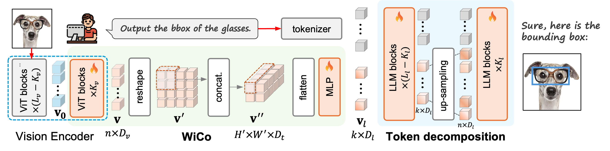
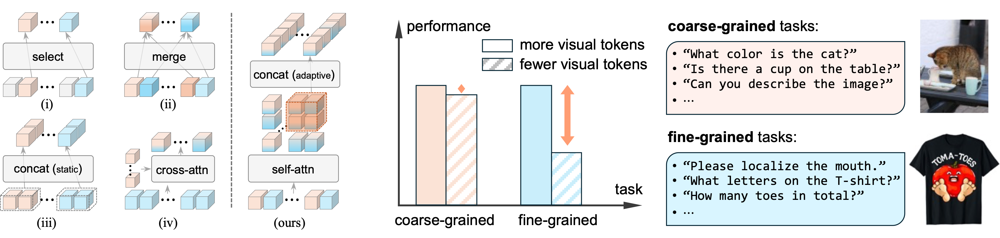

# WiCo: Window Token Concatenation for Efficient Visual Large Language Models

*Exploring efficient projector designs for VLLMs.*

**Window Token Concatenation for Efficient Visual Large Language Models** [[Paper](https://arxiv.org/pdf/2504.04024)]<br>
**Authors:** [Yifan Li](https://jackyfl.github.io), [Wentao Bao](https://cogito2012.github.io/homepage/), [Botao Ye](http://botaoye.github.io), [Zhen Tan](http://zhen-tan-dmml.github.io), [Tianlong Chen](http://tianlong-chen.github.io), [Huan Liu](https://faculty.engineering.asu.edu/huanliu/), [Yu Kong](https://www.egr.msu.edu/~yukong/)

**Abstract:** To effectively reduce the visual tokens in Visual Large Language Models (VLLMs), we propose a novel approach called **Wi**ndow Token **Co**ncatenation (**WiCo**). Specifically, we employ a sliding window to concatenate spatially adjacent visual tokens. However, directly concatenating these tokens may group diverse tokens into one, and thus obscure some fine details. To address this challenge, we propose fine-tuning the last few layers of the vision encoder to adaptively adjust the visual tokens, encouraging that those within the same window exhibit similar features. To further enhance the performance on fine-grained visual understanding tasks, we introduce WiCo+, which decomposes the visual tokens in later layers of the LLM. Such a design enjoys the merits of the large perception field of the LLM for fine-grained visual understanding while keeping a small number of visual tokens for efficient inference.  We perform extensive experiments on both coarse- and fine-grained visual understanding tasks based on LLaVA-1.5 and Shikra, showing better performance compared with existing token reduction projectors.


**Figure 1.** Framework of our WiCo+. WiCo+ consists of two main components, i.e., a dynamic window token concatenation projector (WiCo) and the token decomposition strategy in the later layers of the LLM decoder. WiCo first learns similar local token representations
by kv self-attention layers from the last kv layers of a pretrained vision encoder (say CLIP). Then, a sliding window is adopted on the 2-D
token map to perform concatenation, and an MLP is utilized to project these visual tokens into language space. To further enhance the
perception field of the rest visual tokens, we decompose the visual tokens in the later layers (say the last Kl layers) of the LLM decoder,
which will benefit the fine-grained understanding tasks.


Note: Our repository support multiple baselines for visual token reduction:
| Name           | Type                     | Paper                                                                                                                       | Venue            |
|----------------|--------------------------|-----------------------------------------------------------------------------------------------------------------------------|------------------|
| Token-mixer    | Mixing tokens            | [MLP-Mixer: An all-MLP Architecture for Vision](https://arxiv.org/pdf/2105.01601)                                           | NeurlPS 2021        |
| Concatenation  | Concatenate neighbor tokens | [MiniGPT-v2: Large Language Model as a Unified Interface for Vision-Language Multi-Task Learning](https://arxiv.org/pdf/2310.09478) | ICLR 2024       |
| Perceiver      | Cross-attention          | [Flamingo: A Visual Language Model for Few-Shot Learning](https://proceedings.neurips.cc/paper_files/paper/2022/file/960a172bc7fbf0177ccccbb411a7d800-Paper-Conference.pdf) | NeurIPS 2022     |
| C-Abstractor    | Convolution + pooling    | [Honeybee: Locality-Enhanced Projector for Multimodal LLM](http://openaccess.thecvf.com/content/CVPR2024/papers/Cha_Honeybee_Locality-enhanced_Projector_for_Multimodal_LLM_CVPR_2024_paper.pdf) | CVPR 2024        |
| Tokenfilter    | Token selection          | [TextMonkey: An OCR-Free Large Multimodal Model for Understanding Document](https://arxiv.org/pdf/2403.04473)               | CVPR 2024       |
| LLaVA-Prumerge | Selection + merging      | [LLaVA-PruMerge: Adaptive Token Reduction for Efficient Large Multimodal Models](https://arxiv.org/pdf/2403.15388)          | arXiv 2024       |
| ToMe           | Token Merging            | [Token Merging: Your ViT But Faster](https://arxiv.org/pdf/2210.09461)                                                      | ICLR 2023        |



**Figure 2.** (a) Current projector types (left) and ours (right) for VLLM token reduction. Existing token reduction projectors are mainly based on (i) selection, (ii) merging, (iii) concatenation and (iv) cross-attention.  
(b) This figure illustrates that the performance of VLLMs is sensitive to the types of downstream tasks when changing the number of visual tokens. Specifically, the performance of VLLMs drops more significantly for fine-grained understanding tasks compared to coarse-grained selection/merging tasks when reducing visual tokens.
## Contents
- [Install](#install)
- [Train](#train)
- [Evaluation](#evaluation)

## Install

1. Clone this repository and navigate to LLaVA folder
```bash
git clone https://github.com/JackYFL/WiCo.git
cd WiCo/LLaVA
```

2. Execute the install.sh bash file.
```
. install.sh
```

**Note:** The install bash file includes two steps: <br>
**Step:1** Install Packages
```Shell
conda create -n llava python=3.10 -y
conda activate llava
pip install --upgrade pip  # enable PEP 660 support
pip install -e .
```

**Step:2** Install additional packages for training cases
```Shell
pip install -e ".[train]"
pip install flash-attn ==2.5.3 --no-build-isolation
```

## Train
The training process of LLaVA includes two steps: pretraining (only tuning projector) and finetuning (both projector and LLM).

Before training, all datasets used in LLaVA should be prepared according to the instructions in the [**Data**](LLaVA/docs/Data.md) document.

We provide bash scripts in ``scripts/v1_5``. For instance to train WiCo, just execute:
```Shell
cd LLaVA
. scripts/v1_5/wico/pretrain.sh
. scripts/v1_5/wico/finetune.sh
```

You can refer to [``scripts/v1_5/pretrain.sh``](LLaVA/scripts/v1_5/wico/pretrain.sh) and [``scripts/v1_5/finetune.sh``](LLaVA/scripts/v1_5/wico/finetune.sh) for more information.

## Evaluation
Before evaluation, all the datasets should be prepared according to the [Evaluation](LLaVA/docs/Evaluation.md) document.

We also provide bash script for convenience. To evaluate WiCo, just execute:
```Shell
cd LLaVA
. scripts/v1_5/wico/eval.sh
```

# Citation
If you find WiCo useful for your research and application, please cite this BibTex:
```bibtex
@inproceedings{
  title={Window Token Concatenation for Efficient Visual Large Language Models},
  author={Li, Yifan and Bao, Wentao and Ye, Botao and Tan, Zhen and Chen, Tianlong and Huan, Liu and Kong, Yu},
  booktitle={Proceedings of the IEEE/CVF Conference on Computer Vision and Pattern Recognition Workshop},
  year={2025}
}
```

# Acknowledgement

Thanks for these insightful codebases!
- [LLaVA](https://github.com/haotian-liu/LLaVA): The codebase we built on for general VQA task.
- [Shikra](https://github.com/shikras/shikra): The codebase we built on for grounding task.
- [MiniGPT4](https://github.com/Vision-CAIR/MiniGPT-4): The token concatenation projector.
- [Honeybee](https://github.com/khanrc/honeybee): The C-Abstractor projector.
- [Monkey](https://github.com/Yuliang-Liu/Monkey): The tokenfilter projector.
- [LLaVA-Prumerge](https://github.com/42Shawn/LLaVA-PruMerge): The LLaVA-Prumerge projector.
- [ToME](https://github.com/facebookresearch/ToMe): The ToME projector.